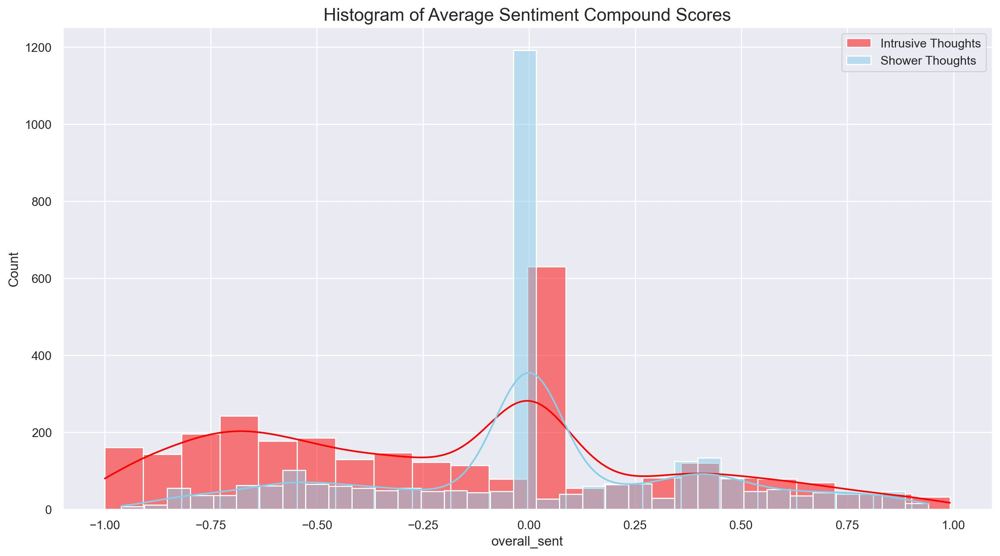
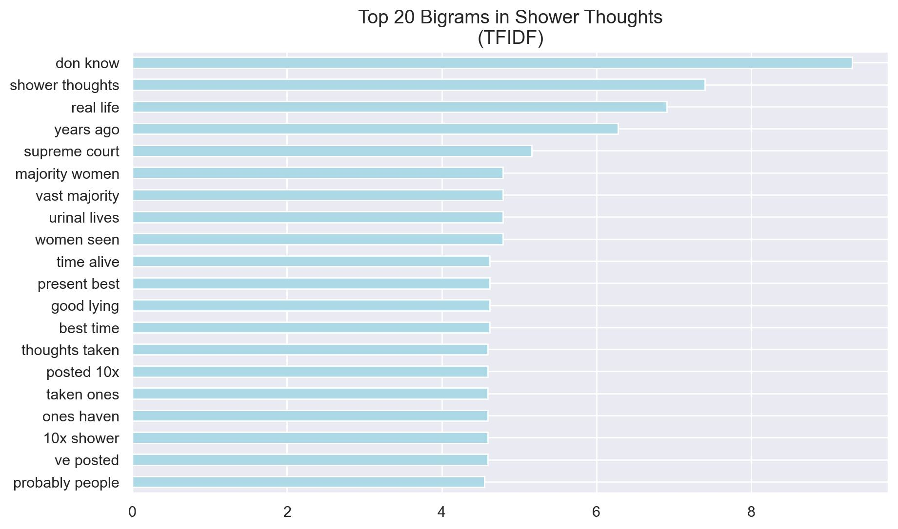
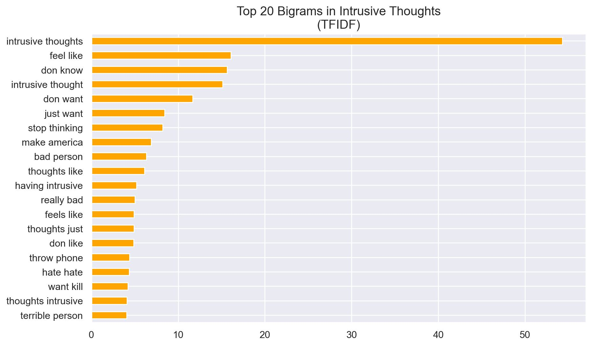
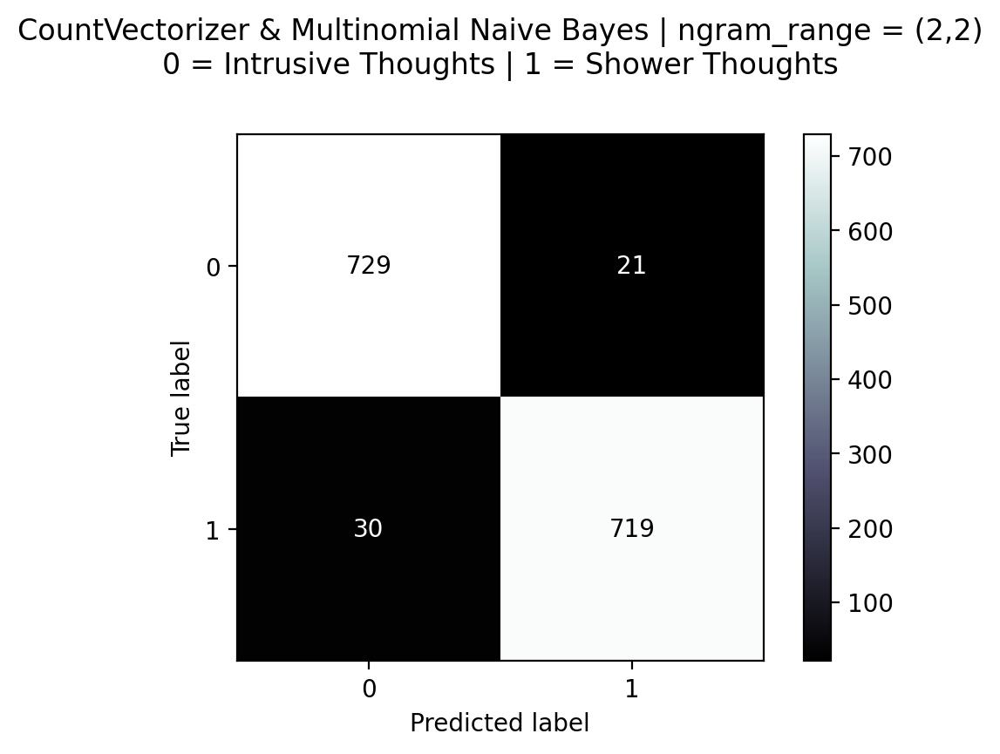

# Project 3 | DSI 523
## Reddit API, Natural Language Processing, & Classification Modeling
## by Adriana J. Machado
-----
-----
# Background & Food for Thought
Can we really *know* what someone is thinking or feeling and use that information to predict their future behaviors?

Behavioral health can be a controversial subject for people. On the one hand, people don't want to be reduced to a diagnosis--have their head shrunk. On the other hand, people find ways of coping and self-discovery through exploration with a trained professional (I am one of these people). 

Some background on how I came to this topic. I am an advocate for mental health and have managed my own ups and downs through various avenues. I’m a huge fan of therapy and have done some volunteer crisis counseling myself. So, analyzing thoughts is something I think about often. 

## So, what?

Ethics can start to seep into the early movements of this developing technology. As we distinguish language and use those distinctions to determine next steps for individuals, the steps taken to treat each interaction carefully could make a huge impact. 

One law that comes to mind is the Tarasoff Law. This is a legal obligation by certain professionals to report (mandated reporting) individuals to law enforcement, whose behavior they believe may be violent and put themselves or others in harm (homicidal and suicidal tendancies) [(source)](https://www.ncsl.org/research/health/mental-health-professionals-duty-to-warn.aspx).

No one wants to be put into a system for saying something that got taken the wrong way.

### In a post-pandemic world, telehealth services are becoming increasingly sought after.

- 1964-1966: ELIZA (MIT Artificial Intelligence Laboratory by Joseph Weizenbaum): The first natural language processing program to successfully act as a Rogerian psychotherapist (parrot back and appear empathetic) [(source)](https://en.wikipedia.org/wiki/ELIZA). [(HyperNormalization YouTube Video)](https://www.youtube.com/watch?v=84QouA9Sm4E)
- 2019: 38% increase in telehealth options for mental health facilities [(source)](https://www.samhsa.gov/data/report/telemedicine-services).
- 2019: 840,000 Medicare telehealth utilization [(source)](https://www.hhs.gov/about/news/2021/12/03/new-hhs-study-shows-63-fold-increase-in-medicare-telehealth-utilization-during-pandemic.html).
- 2020: 68.7% increase in telehealth options for mental health facilities [(source)](https://www.samhsa.gov/data/report/telemedicine-services).
- 2020: 52.7 million Medicare telehealth utilization (63-fold from 2019) [(source)](https://www.hhs.gov/about/news/2021/12/03/new-hhs-study-shows-63-fold-increase-in-medicare-telehealth-utilization-during-pandemic.html).

### The telehealth industry is booming...

- Telehealth as a whole could be a $250 billion dollar industry [(source)](https://www.mckinsey.com/~/media/McKinsey/Industries/Healthcare%20Systems%20and%20Services/Our%20Insights/Telehealth%20A%20quarter%20trillion%20dollar%20post%20COVID%2019%20reality/Telehealth-A-quarter-trilliondollar-post-COVID-19-reality.pdf).
- The global mental health apps market size was valued at USD 4.2 billion in 2021 and is expected to expand at a compound annual growth rate (CAGR) of 16.5% from 2022 to 2030. 5.2 billion in 2022 and 17.5 billion in 2030 [(source)](https://www.grandviewresearch.com/industry-analysis/mental-health-apps-market-report).

### ...and AI and #AIProbs are also developing.

- Funded, widely-used, nonprofit mental health services are using AI to detect crises in help-seekers [(source)](https://www.crisistextline.org/blog/2018/03/28/detecting-crisis-an-ai-solution/).
- Mozilla has a running list of mental health apps (counseling/therapy, prayer, meditation, etc.) and their data privacy ratings [(source)](https://foundation.mozilla.org/en/privacynotincluded/categories/mental-health-apps/).
- "And according to this 2020 article by Jezebel, BetterHelp shares metadata from every message, though not its contents, with Facebook. This means that Facebook could know what time of day a user was going to therapy, their approximate location, and how long they were chatting on the app." [(Mozilla source](https://foundation.mozilla.org/en/privacynotincluded/betterhelp/) | [Jezebel source)](https://jezebel.com/the-spooky-loosely-regulated-world-of-online-therapy-1841791137)

### Some words of wisdom from Joel Paris (he's a pretty credible guy)

"...psychiatry is overstretched: ‘Instead of prescribing treatment for what Freud once called “normal human unhappiness”, we need to focus our efforts on patients who are seriously ill, and who need us the most. We do not need to diagnose the human condition’ (p. xiv)...

...When does sadness turn into depression, particularly when life stressors (grief, job loss, breakups of intimate relations) that would upset almost anyone are present? When should anxiety and worry justify diagnosis if there is something real to worry about? At what point is substance use an addiction?"
[(source)](https://www.ncbi.nlm.nih.gov/pmc/articles/PMC6818431/)

## Now, what?

People tend to be more honest when they're anonymous [(source)](https://jamanetwork.com/journals/jamapsychiatry/fullarticle/1107428). What better place to find some honest thoughts to experiment on, than a public message board from the world wide web. 

[r/ShowerThoughts](https://www.reddit.com/r/Showerthoughts/) is a subreddit where people post their shower thoughts. "At their best, showerthoughts are universally relatable and find the amusing/interesting within the mundane."

[r/IntrusiveThoughts](https://www.reddit.com/r/intrusivethoughts/) is "A subreddit for you to share all those intrusive, obsessive and recurring thoughts or ideas that race through your head throughout the day. Intrusive thoughts are random or recurring thoughts you have that make you want to do crazy things, such as "hit him with your car or jump off the building."

By comparing language in casual thoughts to neurotic thoughts, my model was able to distinguish the language in between the two subreddits with a 98.2% training accuracy and 96.5% test accuracy. 

**This isn't at all a clinical study or an ethical solution.** But it can show how the thoughts of a user, determined by the user to be casual or neurotic, can be distinguished using classification models. Self-diagnosis seems like a pretty safe sandbox for a non-clinical experiment.

# Methodology
-----

## 1.0 Gathering and Cleaning Data
Using Reddit's [PushShift API](https://api.pushshift.io/reddit/search/submission?subreddit=boardgames), post data (not comment data) was pulled from Shower Thoughts and Intrusive Thoughts. About 3000 rows of each. The API only allowed for 100 posts to be pulled at a time so the function pull_sub_df was created where the subreddit and how many posts could be input for a dataframe output of the request. 

The data was then cleaned for HTML language, english stop words, and nulls. 

## 2.0 Exploratory Data Analysis
Sentiment analysis was conducted on the entire dataset using nltk's SentimentIntensityAnalyzer. Each row's title and selftext (body) were analyzed separately then an overall sentiment was calculated by either taking the average (if both scores were available) or the available score. Some data was redacted or removed from the dataset by the subreddit's moderators for whatever reason so often selftext was removed and a score of 0 was left. Since 0 was not a true score and actually just represented a null value, the score of the title was taken instead. Or vice versa. 

**Overall Shower Thoughts was pretty neutral and Intrusive Thoughts was negative. Both had a lot of neutral posts.**

After the sentiment analysis, the word tokens were explored. Single words and bigrams were explored for both subreddits using CountVectorizer and TFIDF Vectorizer from sklearn. Insightful. Below are charts from the TFIDF bigrams. 

## 3.0 Modeling
Various combinations of sklearn's CountVectorizer, TFIDF Vectorizer, Multinomial Naive Bayes, and Logistic Regression were used with GridSearch and ngram and stop_word parameters. All models were pretty comparable so I went with the one that had the least amount of overfitting and a high accuracy score. 

CountVectorizer and Multinomial Naive Bayes ended up being the best fit model. My initial thoughts were that TFIDF would be better than CVec because of the search for frequent and unique words. I was wrong. 

- CNB Train Accuracy: 0.9828698553948833
- CNB Test Accurcy: 0.9659773182121414
- Train-Test Diff: 0.016892537182741862
- CNB Best Params: {'cvec__ngram_range': (2, 2), 'cvec__stop_words': None}

Support 749 (1: is_shower)
- CNB Test Precision: .97
- CNB Test Recall: .96
- CNB Test F1 (prec & recall): .97

I threw in a VoteClassifier with a DecisionTree (which takes a while to run) but the score on the train set didn't even come close to the other models so left that one alone. 

## 4.0 File Directory
| Folder | Filename | Type | Description |
| ------ | -------- | ---- | ----------- |
| main | README | markdown | Description of project, narrative, and conclusions |
| main | Project 3 Classification - Adriana Machado - DSI 523 | .pdf | Slides from presentation |
| main | ProjectScope | markdown | original project description and rubric |
| code | 01_intro_imports_cleaning | .ipynb | notebook with code for Reddit API and data cleaning. |
| code | 02_EDA | .ipynb | notebook with EDA and plots  |
| code | 03_modeling | .ipynb | notebook comparing different models and final best model |
| data | intrusive_df_raw | .csv | raw API pull of r/IntrusiveThoughts |
| data | shower_df_raw | .csv | raw API pull of r/ShowerThoughts |
| data | intrusive_shower_raw | .csv | concatenated intrusive_raw and shower_raw |
| data | intrusive_shower_clean | .csv | cleaned concatenated set (html, tokens, etc.) |
| data | intrusive_shower_clean_sent | .csv | cleaned concatenated set with sentiment analysis columns |
| data | intrusive_shower_final | .csv | final dataset for modeling with cleaned 'title_self' text column for X-variable and 'is_shower' binary column for target y-variable |
| images | gs_cnb_confusion_matrix | jpeg & png | confusion matrix of final model |
| images | sentiment_hist | jpeg & png | histogram showing sentiment analysis for r/ShowerThoughts and r/IntrusiveThoughts |
| images | tfidf_it_bigrams | jpeg & png | bar chart of top 20 r/IntrusiveThoughts bigrams from TFIDF vectorizer |
| images | tfidf_it_words | jpeg & png | bar chart of top 20 r/IntrusiveThoughts single words from TFIDF vectorizer |
| images | tfidf_st_bigrams | jpeg & png | bar chart of top 20 r/ShowerThoughts bigrams from TFIDF vectorizer |
| images | tfidf_st_words | jpeg & png | bar chart of top 20 r/ShowerThoughts single words from TFIDF vectorizer |

# Recommendations
-----

If this were to be used as a premise for further research and development in the field of telehealth and the use of AI in mental health services. I'd say using control groups but maintaining the anonymity of reporting could prove to be insightful. 

Predicting if a thought is intrusive versus a shower thougth is nice and all but comparing the two when they come from the same mind could be more insightful and how this varies across a diverse cross-section of the population.

It's also important to keep iterating on these models and make sure new data is still running with high accuracy. 

How this type of information is used begs more questions that have been asked about the field of psychology since diagnosis became a thing. The concern of calling 911 on a suicidal person and putting them permanently into a system for a temporary psychological lapse, is a growing concern. Many municipalities are seeing how this permanent trauma to a temporary problem can be avoided by developing crisis departments and increasing training to distinguish mental health crises from violent crimes.